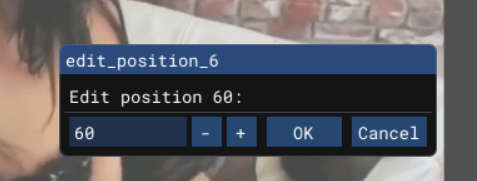
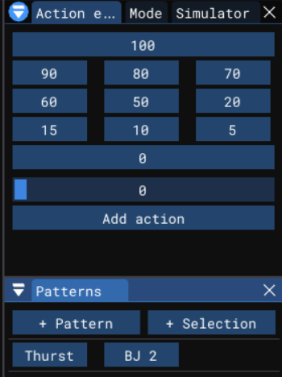
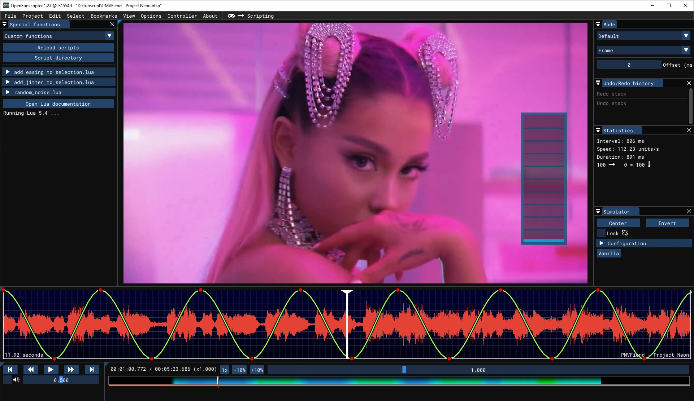

# OpenFunscripter

Can be used to create `.funscript` files. (NSFW)  
The project is based on OpenGL, SDL2, ImGui, libmpv, & all these other great [libraries](https://github.com/nerdtoys69/OFS/tree/master/lib).

### V5 Features

- **Custom Action Editor** — Create and edit custom actions
- **New Patterns** — Additional pattern options for funscripts

### How to build ( for people who want to contribute or fork )
1. Clone the repository
2. `cd "OpenFunscripter"`
3. `git submodule update --init`
4. Run CMake and compile

Known linux dependencies to just compile are `build-essential libmpv-dev libglvnd-dev`.  
