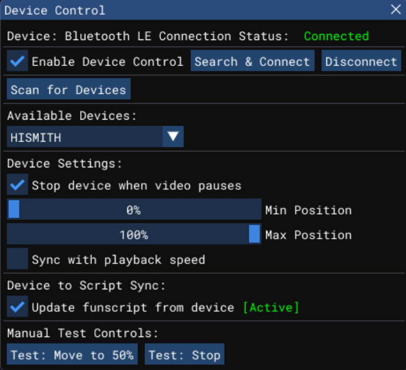
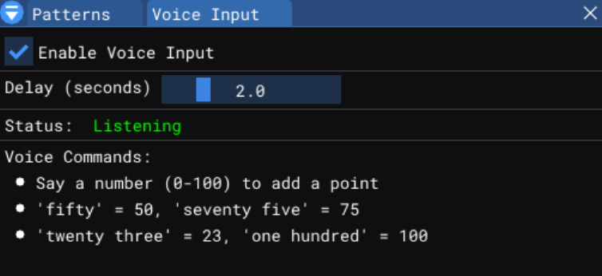
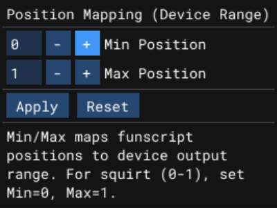

# OpenFunscripter

[](https://github.com/NerdT69/OFS/releases/latest)
[](https://www.gnu.org/licenses/gpl-3.0)
[](https://github.com/NerdT69/OFS/releases)
[](https://github.com/NerdT69/OFS/releases/latest)
[](https://github.com/NerdT69/OFS/releases/latest)
[](https://github.com/NerdT69/OFS/releases/latest)

Can be used to create `.funscript` files. (NSFW)  
The project is based on OpenGL, SDL2, ImGui, libmpv, & all these other great [libraries](https://github.com/NerdT69/OFS/tree/master/lib).

## V5.12 Features

- **Custom Action Editor** — Create and edit custom actions
- **New Patterns** — Additional pattern options for funscripts
- **Enhanced Device Support** — Improved connectivity with various devices
- **Mic / Voice Controls** — Voice input support for controlling actions
- **Position Mapping** — Map script positions to different ranges
- **Squirt Script Axis** — Support for additional script axis types
- **Performance Improvements** — Better overall application performance

### Screenshots

| Custom Action Editor | Pattern Panel | Device Manager | Voice Controls | Position Mapping |
|:---:|:---:|:---:|:---:|:---:|
|  |  |  |  |  |


## How to Build (for contributors and forks)

1. Clone the repository
2. `cd "OpenFunscripter"`
3. `git submodule update --init`
4. Run CMake and compile

### Linux Dependencies

Known Linux dependencies to compile:
```
build-essential libmpv-dev libglvnd-dev
```

---

*OpenFunscripter - Version 5.12*
