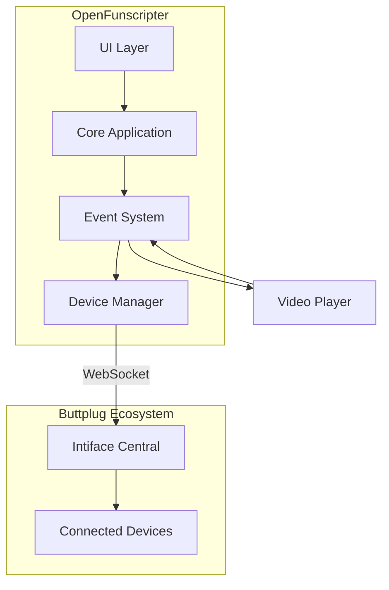

# OpenFunscripter Device Control Integration Plan

## Overview

This document outlines the implementation plan for adding device control support to OpenFunscripter, allowing users to connect sex toys (primarily Hismith devices) that work with the buttplug.io ecosystem. When a video plays, connected devices will respond to the funscript positions, and stop when the video stops.

## Architecture



## Key Integration Points

### Existing Systems to Leverage

1. **Event System** - Already has `PlayPauseChangeEvent` and `TimeChangeEvent`
2. **WebSocket API** - Can serve as a reference for WebSocket client implementation
3. **Funscript class** - Has `GetPositionAtTime()` and `SplineClamped()` for position calculation
4. **Preferences system** - For storing device connection settings

## Implementation Steps

### Phase 1: Core Infrastructure

#### 1.1 Add Buttplug Client Library
- **Option A**: Use WebSocket connection to Intiface Central (Recommended)
  - Connect via WebSocket to localhost:12345
  - No native dependencies required
  - Works with all buttplug-compatible devices
  
- **Option B**: Integrate community buttplugCpp library
  - More complex, requires additional dependencies
  - Provides direct device access

**Decision**: Use Option A (WebSocket to Intiface Central) - simpler and more reliable

#### 1.2 Create Device Manager Class
```
src/device/OFS_DeviceManager.h
src/device/OFS_DeviceManager.cpp
```

**Responsibilities**:
- Manage WebSocket connection to Intiface Central
- Handle device scanning and enumeration
- Send commands to connected devices
- Handle connection lifecycle (connect/disconnect/reconnect)

#### 1.3 Create Device State
```
src/state/DeviceState.h
```

**State fields**:
- `bool enabled` - Master enable/disable
- `std::string serverAddress` - Intiface Central WebSocket URL
- `bool autoConnect` - Auto-connect on startup
- `bool pauseWithVideo` - Stop device when video pauses
- `bool syncSpeed` - Match device speed to video playback speed
- `int minPosition` - Minimum stroke position (0-100)
- `int maxPosition` - Maximum stroke position (0-100)

### Phase 2: Device Control Logic

#### 2.1 Event Listeners
Hook into existing events:
- `PlayPauseChangeEvent` - Start/stop device with video
- `TimeChangeEvent` - Update device position
- `PlaybackSpeedChangeEvent` - Optional speed sync

#### 2.2 Position Calculation
```cpp
// In device update loop
float currentTime = player->CurrentTime();
auto activeScript = ActiveFunscript();
if (activeScript) {
    float position = activeScript->GetPositionAtTime(currentTime);
    // OR for smooth interpolation
    float position = activeScript->SplineClamped(currentTime);
    
    // Map to device range
    float mappedPosition = MapRange(position, minPos, maxPos);
    deviceManager->SendPosition(mappedPosition);
}
```

#### 2.3 Device Command Types
- **Linear Command** - For stroke devices (Hismith)
  - Position: 0.0 - 1.0
  - Duration: milliseconds
- **Vibration Command** - For vibrate-only devices
  - Speed: 0.0 - 1.0

### Phase 3: User Interface

#### 3.1 Device Panel Window
```
src/UI/OFS_DevicePanel.cpp
src/UI/OFS_DevicePanel.h
```

**UI Elements**:
- Connection status indicator (connected/disconnected)
- Connect/Disconnect button
- Server address input (default: ws://localhost:12345)
- Device dropdown (when multiple devices connected)
- Enable/Disable toggle
- Settings:
  - [ ] Pause device when video pauses
  - [ ] Sync speed with video playback
  - Position range sliders (min/max)

#### 3.2 Integrate into Main Window
Add device panel toggle in the main application menu/bar

#### 3.3 Preferences Integration
Add device settings to the existing Preferences window

### Phase 4: Testing & Refinement

#### 4.1 Testing Scenarios
- Single device connection
- Multiple device connection
- Video play/pause/stop
- Seek operations
- Playback speed changes
- Disconnect/reconnect handling

#### 4.2 Error Handling
- Connection failures
- Device disconnection during playback
- Invalid server URL
- Timeout handling

## File Changes Summary

### New Files to Create
| File | Purpose |
|------|---------|
| `src/device/OFS_DeviceManager.h` | Device manager header |
| `src/device/OFS_DeviceManager.cpp` | Device manager implementation |
| `src/device/OFS_DevicePanel.h` | Device panel UI header |
| `src/device/OFS_DevicePanel.cpp` | Device panel UI implementation |
| `src/state/DeviceState.h` | Device state definition |
| `lib/ixwebsocket/` | WebSocket client library (or use existing) |

### Files to Modify
| File | Changes |
|------|---------|
| `src/CMakeLists.txt` | Add new source files |
| `src/OpenFunscripter.cpp` | Initialize device manager, add menu item |
| `src/OpenFunscripter.h` | Add device manager member |
| `src/state/PreferenceState.h` | Add device preferences state |
| `src/UI/OFS_Preferences.cpp` | Add device preferences UI |

## WebSocket Protocol (Buttplug)

### Connection
- URL: `ws://localhost:12345` (default)
- Protocol: Buttplug JSON

### Key Messages

**Request Device List**:
```json
{"Id": 1, "Type": "RequestDeviceList"}
```

**Start Scanning**:
```json
{"Id": 2, "Type": "StartScanning"}
```

**Stop Scanning**:
```json
{"Id": 3, "Type": "StopScanning"}
```

**Send Linear Command**:
```json
{
  "Id": 4,
  "Type": "LinearCmd",
  "DeviceIndex": 0,
  "Cmd": {
    "Position": 0.5,
    "Duration": 100
  }
}
```

**Device Added Event**:
```json
{
  "Id": 0,
  "Type": "DeviceAdded",
  "Device": {
    "DeviceIndex": 0,
    "DeviceName": "Hismith Premium",
    "DeviceMessages": ["LinearCmd", "StopDeviceCmd"]
  }
}
```

## Considerations

### Thread Safety
- Device commands should be sent from the main thread or via thread-safe queue
- WebSocket operations should be asynchronous

### Performance
- Position updates at ~60fps (every 16ms) for smooth motion
- Use interpolation between script points for better feel

### User Experience
- Clear visual feedback for connection status
- Graceful degradation if Intiface not running
- Helpful error messages

## Alternatives Considered

### Direct USB/Bluetooth (Hismith)
- Would require native driver integration
- More complex to implement
- Less universal (only Hismith)
- **Rejected**: WebSocket approach is more universal

### Use Existing WebSocket Infrastructure
- Could extend existing OFS_WebsocketApi
- But that's for server, we need client
- **Decision**: Implement separate client

## Next Steps (After Approval)

1. Set up WebSocket client dependency (ixwebsocket or similar)
2. Create DeviceState
3. Implement OFS_DeviceManager with basic connection
4. Add event listeners for play/pause/time
5. Implement position sending
6. Create device panel UI
7. Test with Intiface Central and Hismith device
