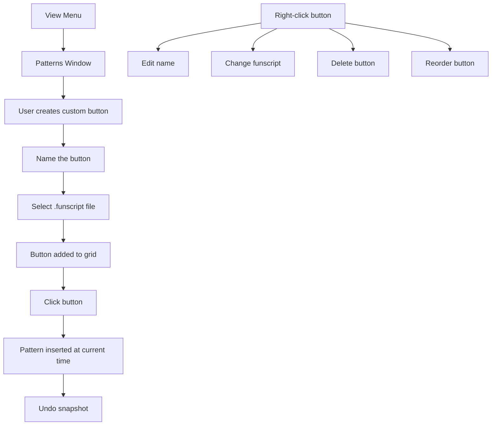

# Pattern Picker Implementation Plan

## Overview
Add a new dockable "Patterns" window to OpenFunscripter with a **fully customizable button system** where users can:
1. **Create unlimited buttons** - Add as many pattern buttons as needed
2. **Name buttons arbitrarily** - Custom names for each button
3. **Load any .funscript** - Each button linked to a funscript file
4. **Arrange buttons** - Organize buttons in a grid layout
5. **Customize appearance** - Button layout persists across sessions

This is essentially a user-configurable "Quick Actions" bar for patterns.

## Architecture

### High-Level Design



### UI Layout - Fully Customizable
```
+--------------------------------------------------+
| Patterns                          [+ Add Button] |
+--------------------------------------------------+
|  +---------------+  +---------------+             |
|  | My Pattern 1  |  | Up Down       |  [+Add]   |
|  |               |  |               |             |
|  +---------------+  +---------------+             |
|                                                  |
|  +---------------+  +---------------+             |
|  | Edge Play     |  | Quick Pump    |  [+Add]   |
|  |               |  |               |             |
|  +---------------+  +---------------+             |
|                                                  |
|  [+ Add Column]                                  |
+--------------------------------------------------+
| Current Time: 00:15.320                          |
+--------------------------------------------------+
```

## Features

### 1. Button Management
- **Add Button**: Create new pattern button
- **Edit Button**: Change name or funscript file
- **Delete Button**: Remove button from grid
- **Duplicate Button**: Copy existing button

### 2. Grid Layout
- **Columns**: Add/remove columns
- **Rows**: Auto-generated based on button count
- **Drag & Drop**: Reorder buttons (future enhancement)
- **Compact Mode**: Smaller buttons option

### 3. Pattern Loading
- File dialog to select .funscript files
- Preview of actions in the funscript
- Store relative path for portability

### 4. Button States
- **Empty**: No funscript assigned
- **Valid**: Has funscript loaded
- **Missing**: Linked file not found

## Data Structure

```cpp
struct PatternButton {
    std::string name;           // Button label
    std::string funscriptPath;  // Path to .funscript file
    int column;                 // Grid column position
    int row;                    // Grid row position
};

struct PatternLayout {
    int columns = 2;                       // Number of columns
    std::vector<PatternButton> buttons;    // All buttons
};
```

## Implementation Details

### Files to Modify/Create

| File | Action |
|------|--------|
| `src/UI/OFS_PatternPicker.h` | Create - Pattern picker header |
| `src/UI/OFS_PatternPicker.cpp` | Create - Pattern picker implementation |
| `src/state/OpenFunscripterState.h` | Modify - Add PatternLayout state |
| `src/OpenFunscripter.cpp` | Modify - Add window to View menu |
| `src/OpenFunscripter.h` | Modify - Add PatternPicker member |
| `data/lang/en.csv` | Modify - Add localization strings |
| `CMakeLists.txt` | Modify - Add new source files |

## Step-by-Step Implementation

### Step 1: Create Pattern Picker Component
- `OFS_PatternPicker.h` - PatternButton struct and class
- `OFS_PatternPicker.cpp` - Full UI implementation

### Step 2: Add State Management
- Add `PatternLayout patternLayout` to OpenFunscripterState
- Add `bool showPatternsWindow`
- Serialize pattern layout to JSON

### Step 3: Implement Button Grid UI
- Dynamic grid based on column count
- "Add Button" functionality
- Right-click context menu for editing

### Step 4: Implement Add Button Flow
1. Click "Add Button"
2. Dialog prompts for button name
3. File dialog to select .funscript
4. Button added to first available slot

### Step 5: Implement Pattern Insertion
- Click button → load funscript → insert at current time
- Time-relative insertion
- Undo support

### Step 6: Context Menu Options
- Edit Name
- Change Funscript
- Move to Column
- Delete

### Step 7: Add to View Menu
- View → Patterns toggle

### Step 8: Persistence
- Save layout to app state
- Load on startup

## Interaction Flow

### Creating a New Button
```
1. User clicks "+ Add Button"
2. Input dialog: "Enter button name:"
3. User types: "My Pattern"
4. File dialog opens: "Select .funscript file"
5. User selects file
6. Button appears in grid
```

### Using a Button
```
1. User positions video at desired time
2. User clicks pattern button
3. Funscript actions loaded
4. Actions inserted starting at current time
5. Undo snapshot created
```

### Editing a Button
```
1. User right-clicks button
2. Context menu appears:
   - Rename
   - Change Funscript
   - Move to Column > [1, 2, 3...]
   - Delete
3. User selects action
```

## Testing Considerations
- Test adding many buttons (10+)
- Test column layout with various counts
- Test pattern insertion at different times
- Test undo/redo
- Test persistence across restarts
- Test missing funscript handling
- Test right-click context menu
