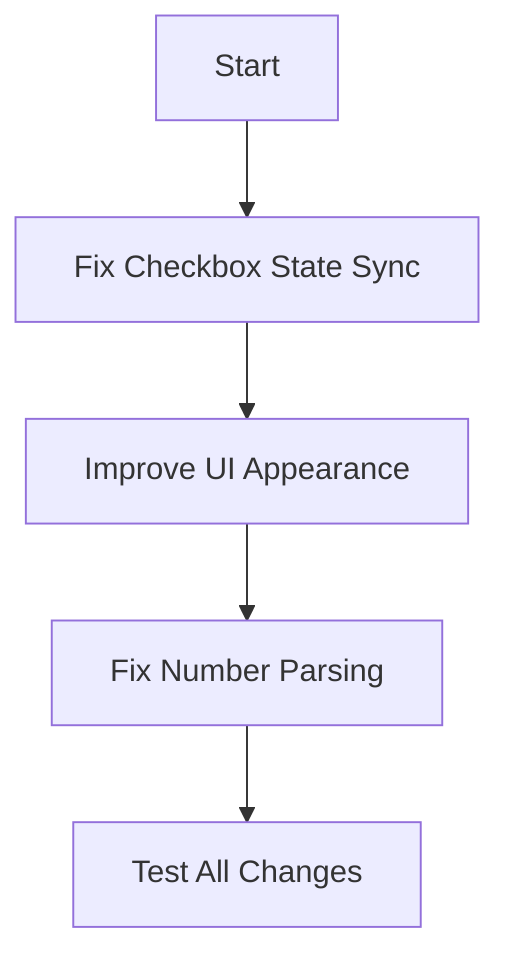

# Voice Input Fix Plan

## Issue Analysis

### 1. Checkbox Not Clicking/Unclicking (Enable Voice Input)
**Location:** `src/util/OFS_VoiceInput.cpp` and `src/UI/OFS_Preferences.cpp`

**Problem:** The checkbox in the Voice Input panel calls `SetEnabled()` but does not save the preference to disk. The Preferences checkbox saves to state but may not sync properly.

**Root Cause:** The Voice Input panel checkbox only modifies the in-memory `isEnabled` flag but doesn't save the state. The state is only saved when the app exits via `SaveState()`.

**Fix:** 
- Ensure the checkbox in the Voice Input panel properly syncs with PreferenceState
- Or make it explicitly save the preference when changed

### 2. UI Improvements
**Location:** `src/util/OFS_VoiceInput.cpp:182-221` (Show function)

**Current UI:**
- Basic checkbox
- Manual +/- buttons for delay
- Simple status text

**Proposed Improvements:**
- Use ImGui Slider for delay control (cleaner than +/- buttons)
- Add color-coded status indicator (green/yellow/red)
- Better help text with bullet points
- Add microphone device selector dropdown
- Add manual "Start/Stop Capture" button for testing

### 3. Number Parsing Issues (0, 1, 20, 50, etc.)
**Location:** `src/util/OFS_VoiceInput.cpp:285-369` (ParseNumberFromText function)

**Potential Issues:**
- The parser may have logic errors in compound number handling
- "zero" / "oh" recognition may be inconsistent
- Single digit parsing may have edge cases

**Proposed Fixes:**
- Review and fix the number parsing logic
- Add logging to see what whisper actually transcribes
- Test with various number formats

## Implementation Steps

## Files to Modify

1. `src/util/OFS_VoiceInput.cpp` - Main fixes
2. `src/util/OFS_VoiceInput.h` - If needed
3. `src/UI/OFS_Preferences.cpp` - If checkbox sync needed

## Success Criteria

- [ ] Voice Input checkbox toggles and saves state properly
- [ ] UI looks cleaner with slider for delay
- [ ] Number parsing correctly handles 0, 1, 20, 50, 75, etc.
